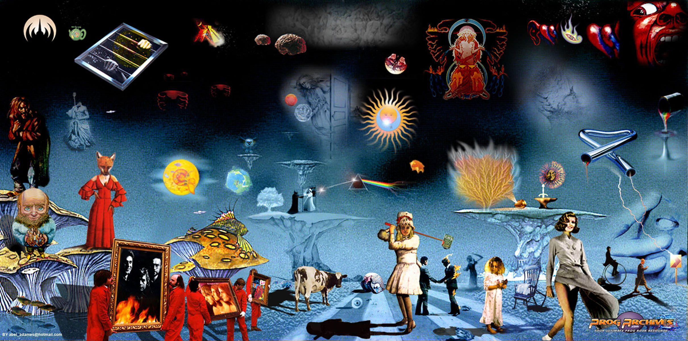

# 10 Prog Gems

### This page describes [Pickles Prog Spotify Playlist](https://open.spotify.com/playlist/3Bt7uarJOr161i0p8J5R1U?si=1d0c4753438a4ab2)

[Firth of Fifth](https://en.m.wikipedia.org/wiki/Firth_of_Fifth)
- By: Genesis 
- Album: [Selling England by the Pound](https://open.spotify.com/album/2tSRe2rkdJvZWMOIZpu6lk?si=MFdDDbFWTFaqseHHdhwR3Q)
- 1973
- On pretty much anyone's prog top 10, and definitely one of my favourites. Check-out the Album [Foxtrot](https://open.spotify.com/album/1P9AuGH530Oy9JEW5XVuxo?si=5ry6sHGKRzydouJ_XUi_7A) as well. 

[Stairway to Heaven](https://en.m.wikipedia.org/wiki/Stairway_to_Heaven)
- By: Led Zeppelin
- Album: [Led Zeppelin IV](https://open.spotify.com/album/44Ig8dzqOkvkGDzaUof9lK?si=Lpu0eA1LT2KFeQFfWsgkpQ)
- 1971
- Not everyone would count this as prog. But it's started appearing on prog lists, and I'm happy to be inclusive because it's a great song.
  
[School](https://en.m.wikipedia.org/wiki/School_%28Supertramp_song%29)
- By: Supertramp
- Album: [Crime of the Century](https://open.spotify.com/album/2wrHaulTgqqkVKx0k7Kq4r?si=9EXW5RLOTr23yDNPo5qWvQ)
- 1974
- Not a conventional choice, but I wanted Supertramp on the list, and I like this song more than the more obvious ones.

[Comfortably Numb](https://en.m.wikipedia.org/wiki/Comfortably_Numb)
- By: Pink Floyd
- Album: [The Wall](https://open.spotify.com/album/6WaIQHxEHtZL0RZ62AuY0g?si=SHQyUJ86Tzi_V_cw_UFiNQ)
- 1979
- Some misguided people say Pink Floyd aren't prog. But they're wrong. I think their best albums are [Dark Side of the Moon](https://open.spotify.com/album/2WT1pbYjLJciAR26yMebkH?si=_Yus99bOTlGKw8jyXpLTBQ) and [Wish You Were Here](https://open.spotify.com/album/6uvBKDGlJAYLH5Vy6RQVsc?si=nUzenwV0RiuO4FeWXXGGIw), and it's good to listen to them as a whole. This song isn't on either, and stands well alone.
  
[Can you Understand?](https://en.m.wikipedia.org/wiki/Ashes_Are_Burning)
- By: Renaissance
- Album: [Ashes are Burning](https://open.spotify.com/album/1C2fgiQmiTF9Dr8NdbPSou?si=k3ahI5-iR-qiSpWF7gSWXQ)
- 1973
- An unconventional choice. But I've been enjoying it a lot recently, and it's my list so there you are.

[Bohemian Rhapsody](https://en.m.wikipedia.org/wiki/Bohemian_Rhapsody)
- By: Queen
- Album: [A Night at the Opera](https://open.spotify.com/album/1GbtB4zTqAsyfZEsm1RZfx?si=e87ab95ca9fd4961)
- 1975
- Including this in a prog list would upset some people, but I can't think of any reason not to.

[The Court of the Crimson King](https://en.m.wikipedia.org/wiki/The_Court_of_the_Crimson_King)
- By: King Crimson
- Album: [In the Court of the Crimson King](https://open.spotify.com/album/6tVg2Wl9hVKMpHYcAl2V2M?si=b074fb287def4474)
- 1969
- At least one track from this album has to be included on every prog top 10. That's the law.

[Shadow of the Hierophant](https://en.wikipedia.org/wiki/Voyage_of_the_Acolyte)
- By: Steve Hackett
- Album: [Voyage of the Accolyte](https://open.spotify.com/album/4twSmtePdvfZhSpI2LV5W2?si=44391c3a23504e89)
- 1975
- Another unconventional choice, but I think it's a classic. The album as a whole I'm less keen on. 

[Roundabout](https://en.wikipedia.org/wiki/Roundabout_(Yes_song))
- By: Yes
- Album: [Fragile](https://open.spotify.com/album/0dZF93WHyOhTWjz5EWM7yG?si=fcba58f65d154fe3)
- 1971
- On every list of prog classics, with good reason.
  
[Aqualung](https://en.wikipedia.org/wiki/Aqualung_(album))
- By: Jethro Tull
- Album: [Aqualung](https://open.spotify.com/album/0NGM3Ftwjw0dLNpAowmz3x?si=932d8cb932904f01)
- 1971
- I wanted to include a Jethro Tull track. There may be others that fans would recommomend over this song, but it is one that I know well, so that's why it's here.

Other lists:
- [Top 10 Prog Albums](https://www.youtube.com/watch?v=I4_YMKQUSqI)
- [Top 10 Prog Songs](https://www.youtube.com/watch?v=TMDgU-DLxB8)
